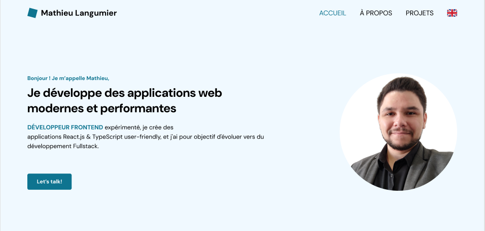
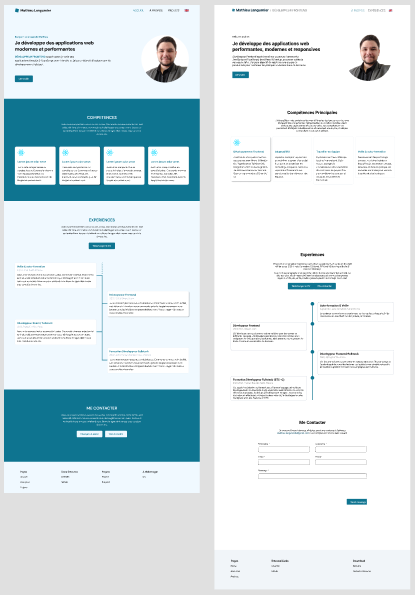

# Portfolio

Hello and welcome! This project is meant to showcase some of my skills as well as examples of projects I have been working on. I will be adding more features, pages, and projects, so feel free to come back from time to time and [check out what's new](https://mathieulangumier.vercel.app)!

**I am currently looking for a new opportunity, so if you're looking for someone with this set of skills, feel free to [send me a message](https://www.linkedin.com/in/mathieu-langumier/)!**

## Table of Contents

- [Table of Contents](#table-of-contents)
- [Who am I?](#who-am-i)
- [The Project](#the-project)
  - [Starting Process](#starting-process)
    - [A Rocky Start](#a-rocky-start)
    - [Rework - Design with Figma](#rework---design-with-figma)
  - [Stack](#stack)
    - [Core Stack - React/Next.js \& TypeScript + Zod](#core-stack---reactnextjs--typescript--zod)
    - [Style - Tailwind CSS v4](#style---tailwind-css-v4)
    - [Teamwork - Docker, Git, Github](#teamwork---docker-git-github)
    - [Formatting - Prettier, ESLint, Husky](#formatting---prettier-eslint-husky)
    - [Internationalization - Next-intl](#internationalization---next-intl)
    - [Deployment - Vercel](#deployment---vercel)
- [How to Use this Project](#how-to-use-this-project)
  - [Next.js](#nextjs)
  - [Docker](#docker)
  - [Style \& Formatting](#style--formatting)
- [Future](#future)
- [Contact](#contact)

## Who am I?

Hi, I'm **Mathieu Langumier**. I'm a `Front-end Developer` with around two years of experience in `React`, `Next.js` & `TypeScript`. I've also worked on projects with Ionic, Prismic, Vue.js & Node/Express.js with PostgreSQL. I love taking part in all aspects of developing a project. Creating and assembling the different pieces, and seeing how they all interact with eachother, is fascinating! That's why my long-term **goal** is to work as a `Full-stack Developer` and truly work on all aspects on a project.

Outside of coding, I always try and take some time to play D&D or video games with friends, enjoy a show with a good story, or simply do something relaxing, like reading a book or spending time whittling little animals while listening to music.

## The Project

Although this project only displays a landing page, the idea was to **setup** the project as I would in a **professional environment**. Therefore, I'm using some dependencies that are not necessary for the project in its current state. But, since I will be adding other pages and features, this starting setup will allow me to expand and add features without refactoring the whole project - which I have already done once (see the following section).

### Starting Process

#### A Rocky Start

Indeed, as I was planning the content and structure of this project, one thing I didn't plan for was the design. Sure, I had spent some time researching portfolios, templates and other ideas, but I didn't have a definitive visual guide. So, I started coding, never sure of what style I wanted, or if my components' style would go well with the rest. But I already had most of the content I had planned at this time, so I decided to finish this version, and then started working on a **[proper design in Figma](https://www.figma.com/design/VfFVEGdjzBooyy6RyFCJzK/Portfolio?node-id=0-1&t=XGvWvvBTXZ2xmJpN-1)**.

#### Rework - Design with Figma

And it was a great experience! I hadn't worked on **`Figma`** for a while - usually integrating designs, but not creating them - but I still remembered how to set up the `theme & variables`, `components & variants`, and how to work with the `12-columns layout`. Applying this knowledge, and at the same time researching and learning about design & UI/UX's best practices allowed me to rework this website in a way that fit what I had in mind and would be much more visually appealing.

  

  
Two versions of the new design

### Stack

Now, as I said, the goal was to setup this project as I would in a professional environment. With that in mind, there were a few things to consider, and dependencies to pick:

#### Core Stack - React/Next.js & TypeScript + Zod

My area of expertise, so these were the best candidates for this project. `React` for the effective use of hooks, `Next.js` for server & client components, and `TypeScript` because using types makes managing data and props so much easier, and `Zod` is perfect for data validation and type inference with TS.

#### Style - Tailwind CSS v4

I see what you're wondering: "No ShadCn??", and I have thought about it, but my goal was to first work on more advanced `Tailwind CSS` features, and get a more in-depth understanding of this library. Now that I have, there is a good chance I'm going to use ShadCN on future projects, and I might even add it to this project at some point.

#### Teamwork - Docker, Git, Github

Using `Git` for versioning - of course - allows me to keep using branch management and merging methods as I would when working within a team.
Since `Github` is free, it is the perfect tool to keep our project on. Moreover, this allows us to use Vercel for deployment with minimal setup.
`Docker` is perfect for a team, it allows everyone to use the project with the same setup regarding Node, NPM and other setup. (Not relevant here because it's not set up, but it also simplifies the use of back-end projects for Front-end developers).

#### Formatting - Prettier, ESLint, Husky

`Prettier` & `ESLint` allows everyone working on this project to use the same formatting rules, regardless of their VSCode settings. It prevents another contributor from saving a file and having their VSCode auto-formatting the whole file - which would show on commits.
`Husky` is an additional tool we use to setup a script preventing commits to pass if there are any remaining stylistic or formatting errors.

#### Internationalization - Next-intl

Starting this project, I wanted it to be available in both `French` & `English`, and since I'm using Next.js, this was the first choice.
Being able to understand and speak English is an important skill in this career, and I wanted my portfolio to be available outside of France, since I'm also interested in working outside of France.

#### Deployment - Vercel

For simplicity of use, and because it is free, `Vercel` was my first choice when I was looking to deploy this project. Because their team also works on Next.js, that makes it the optimal way to host a Next.js project. Also, using its Github integration allows me to auto-deploy every pull request made on selected branches (**main** for production, **develop** for development)

## How to Use this Project

If you want to use this project, suggest some changes, or just see how I've set things up, you can start the project in two ways.

### Next.js

The simplest way is to start the project the same way you would any other: `npm i` & `npm run dev`.
Some information about the script: `"dev": "next dev --turbopack --experimental-https"`:

- `--turbopack` is a new Next.js 15 feature, it's a bundler that allows faster local development (not necessary in this project, but always good to have)
- `--experimental-https` generates self-signed certificates that will allow us to use webhooks & authentication without issue later. The url for localhost will now start with `https`.

### Docker

To start the project using Docker - optimal for collaborative environments - we'll want to change a few things: change the host name, add `https certificates`, and start the development server with Docker.

- **Change Host name**: Go into your host name file - `~/../../etc/hosts` for Ubuntu - and add the name `mathieulangumier.local` to the list (you can change it, this is an example).
- **Activate Https certificates**:
  - Install [mkcert](https://github.com/FiloSottile/mkcert)
  - Then use this command to generate the certificates: `mkcert --cert-file mathieulangumier.local.crt --key-file mathieulangumier.local.key mathieulangumier.local`
  - Create a `/certs` folder in your project's root and place the two new files inside of it.
- **Use Docker**:
  - Install `Docker` & `Docker-compose`
  - Use `docker-compose build` to run the project the first time.
  - After that, you can stick with `docker-compose up` to start the dev server and work on your project. You can close the server by pressing `Ctrl + C`, then shutting them down using `docker-compose down` (not required).
- **Warning**: We've set up `Nginx`, but it might not start if you already have another Nginx or Apache server running on port `443`. If this happens, make sure to shut down the other server and try again.

And you're all set! Enjoy!

### Style & Formatting

While working on this project, `Husky` will prevent you from committing changes if there are linting or formatting issues. To avoid this, you can comment the commands in `./.huksy/pre-commit`, which will prevent Husky from checking your code before commit.
Don't forget to reactivate it once you're done!

`Tailwind CSS` & its intellisense allow us to use auto-completion of custom props via VSCode settings. To do that, simply add your prop name to the extension's list in `Tailwind CSS: class attributes`. On this project, we're added `containerStyle` to our list.

## Future

What's coming? What am I working on?
Well, I'm not going to say anything until the next featured are deployed, or - if you're curious - until you see the related commits. What I can tell you, however, is that I will be updating this portfolio regularly with corrective changes, updating the dependencies and related code if required, adding new features, new pages, and at some point new projects. Stay tuned!

## Contact

If you have any questions, you can either send me an email via this [Portfolio](https://mathieulangumier.vercel.app/#contact) or contact me on [LinkedIn](https://www.linkedin.com/in/mathieu-langumier/).
